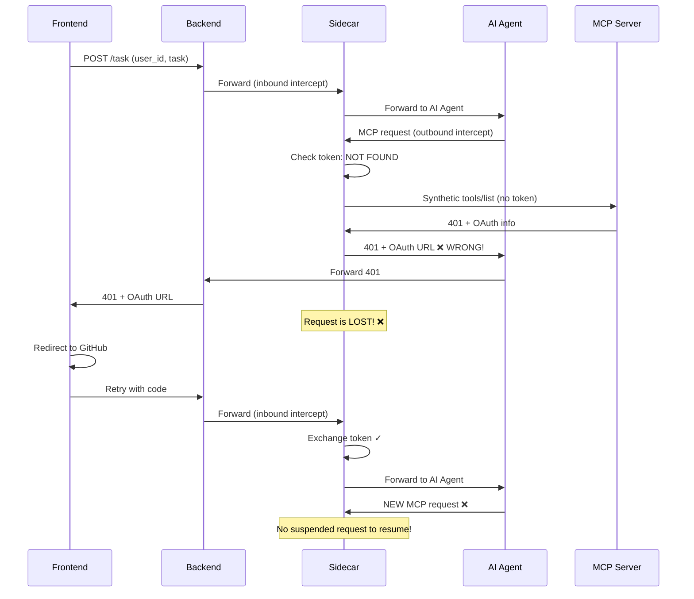
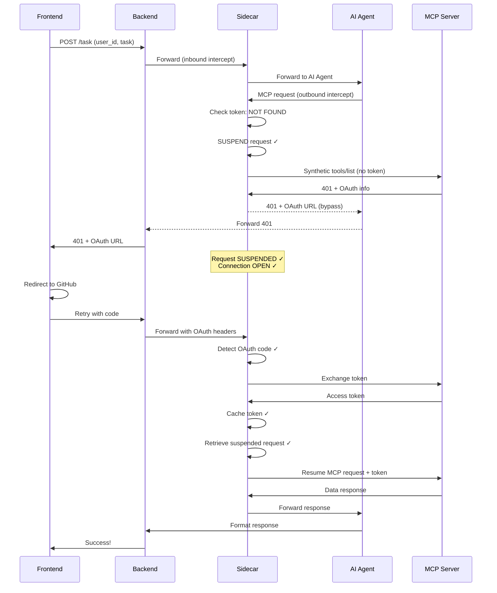

# Sidecar OAuth Flow - Implementation Plan

## Executive Summary

The current sidecar implementation does NOT properly suspend and resume MCP requests during OAuth. This document details the correct flow and required changes.

## Correct Sidecar OAuth Flow

### Initial Request Flow (No Token)

```
1. Frontend → Backend → Sidecar (intercepts inbound) → AI Agent
   - Frontend sends task request with user_id
   - Sidecar intercepts, checks for OAuth code in headers
   - No OAuth code found, forwards to AI Agent

2. AI Agent → Sidecar (intercepts outbound) → MCP Server
   - AI Agent converts task to MCP request
   - Sidecar intercepts outbound MCP request
   - Sidecar checks token cache: NO TOKEN FOUND

3. Sidecar SUSPENDS the original MCP request
   - Store request in memory with user_id as key
   - Keep connection to AI Agent OPEN (blocking)

4. Sidecar sends SYNTHETIC "tools/list" request to MCP Server
   - Send WITHOUT token to trigger OAuth discovery
   - MCP Server returns 401 with OAuth discovery info

5. Sidecar extracts OAuth URL and generates code_verifier
   - Parse 401 response for OAuth metadata
   - Generate PKCE code_verifier and store it

6. Sidecar returns OAuth requirement DIRECTLY to Backend
   - BYPASS AI Agent completely
   - Return 401 with: auth_url, code_verifier, mcp_server_url
   - AI Agent NEVER sees this response

7. Backend → Frontend (redirect to GitHub)
   - Frontend receives 401 with OAuth URL
   - Redirects user to GitHub OAuth page
```

### OAuth Callback Flow (With Token)

```
8. Frontend gets code from GitHub
   - User authorizes on GitHub
   - GitHub redirects back with authorization code

9. Frontend retries task with code → Backend → Sidecar (intercepts inbound)
   - Frontend sends same task + oauth_code + code_verifier
   - Backend forwards to Sidecar

10. Sidecar detects OAuth code in inbound request headers
    - Extract: X-OAuth-Code, X-Code-Verifier, X-MCP-Server-URL
    - Exchange code for token via MCP Server
    - Cache token in memory

11. Sidecar RESUMES the suspended MCP request
    - Retrieve suspended request by user_id
    - Add Authorization header with cached token
    - Forward to MCP Server

12. Response: MCP Server → Sidecar → AI Agent → Backend → Frontend
    - MCP Server returns data (200 OK)
    - Sidecar forwards to AI Agent
    - AI Agent formats response
    - Backend returns to Frontend
```

## Current Implementation Issues

### Issue 1: Sidecar NOT Suspending Requests

**Current Behavior:**
```go
// cmd/authbridge-sidecar/main.go:174-198
if !hasToken {
    // Discovers OAuth, returns 401 immediately
    // Does NOT suspend the request!
    p.sendOAuthRequiredResponse(clientConn, authURL, codeVerifier, mcpServerBaseURL)
    return  // ❌ Connection closed, request lost!
}
```

**Problem:** The sidecar immediately closes the connection and returns 401. The original MCP request is lost.

**Required:** Keep the connection open, store the request, wait for OAuth completion.

### Issue 2: Sidecar NOT Detecting OAuth Code

**Current Behavior:**
```go
// cmd/authbridge-sidecar/main.go:103-135
code := req.Header.Get("X-OAuth-Code")
codeVerifier := req.Header.Get("X-Code-Verifier")

if code != "" && codeVerifier != "" {
    // Exchange token
    err := p.authBridge.ExchangeToken(userID, mcpServerURL, code, codeVerifier)
    // ...
    // Remove OAuth headers
    req.Header.Del("X-OAuth-Code")
    // ...
}
// Forward to AI Agent
p.forwardToAIAgent(clientConn, req)
```

**Problem:** After token exchange, it forwards to AI Agent, but there's NO suspended request to resume!

**Required:** After token exchange, retrieve and resume the suspended MCP request.

### Issue 3: AI Agent Seeing 401 Responses

**Current Behavior:**
```go
// cmd/authbridge-sidecar/main.go:260-280
if resp.StatusCode == http.StatusUnauthorized && p.isMCPServerRequest(req) {
    // Trigger OAuth discovery
    authURL, codeVerifier, err := p.authBridge.DiscoverOAuthRequirements(...)
    // Return OAuth URL to client (AI Agent!)
    p.sendOAuthRequiredResponse(clientConn, authURL, codeVerifier, mcpServerBaseURL)
    return
}
```

**Problem:** The 401 response is being sent back to AI Agent, which should never see authentication errors.

**Required:** Suspend the request before it reaches AI Agent, handle OAuth transparently.

### Issue 4: No Request Suspension Data Structure

**Current State:** No data structure to store suspended requests.

**Required:** Add a map to store suspended requests:
```go
type SuspendedRequest struct {
    Request      *http.Request
    ClientConn   net.Conn
    UserID       string
    MCPServerURL string
    Timestamp    time.Time
}

suspendedRequests map[string]*SuspendedRequest // key: userID
```

## Required Changes

### 1. Sidecar Changes (`cmd/authbridge-sidecar/main.go`)

#### A. Add Request Suspension Data Structure

```go
type SuspendedRequest struct {
    Request      *http.Request
    ClientConn   net.Conn
    UserID       string
    MCPServerURL string
    Timestamp    time.Time
    ResponseChan chan *http.Response
}

type SidecarProxy struct {
    authBridge         *authbridge.AuthBridge
    logger             *slog.Logger
    defaultMCPServer   string
    suspendedRequests  map[string]*SuspendedRequest  // NEW
    suspendedMutex     sync.RWMutex                  // NEW
}
```

#### B. Modify Outbound Handler to Suspend Requests

```go
func (p *SidecarProxy) handleOutbound(clientConn net.Conn, req *http.Request) {
    // ... existing code to check token cache ...
    
    if !hasToken {
        p.logger.Info("No token found, suspending request for OAuth",
            "user_id", userID,
            "mcp_server_base", mcpServerBaseURL)
        
        // SUSPEND the request
        suspended := &SuspendedRequest{
            Request:      req,
            ClientConn:   clientConn,
            UserID:       userID,
            MCPServerURL: mcpServerBaseURL,
            Timestamp:    time.Now(),
            ResponseChan: make(chan *http.Response, 1),
        }
        
        p.suspendedMutex.Lock()
        p.suspendedRequests[userID] = suspended
        p.suspendedMutex.Unlock()
        
        // Send synthetic tools/list to discover OAuth
        authURL, codeVerifier, err := p.authBridge.DiscoverOAuthRequirements(userID, mcpServerBaseURL)
        if err != nil {
            p.logger.Error("OAuth discovery failed", "error", err)
            p.sendErrorResponse(clientConn, http.StatusUnauthorized,
                "Authentication required but OAuth discovery failed")
            p.suspendedMutex.Lock()
            delete(p.suspendedRequests, userID)
            p.suspendedMutex.Unlock()
            return
        }
        
        // Return OAuth requirement DIRECTLY to Backend (bypassing AI Agent)
        // This response goes back through the chain: Sidecar → AI Agent → Backend
        // But AI Agent just forwards it without processing
        p.sendOAuthRequiredResponse(clientConn, authURL, codeVerifier, mcpServerBaseURL)
        
        // WAIT for OAuth completion (blocking)
        select {
        case resp := <-suspended.ResponseChan:
            // OAuth completed, forward response
            resp.Write(clientConn)
        case <-time.After(5 * time.Minute):
            // Timeout
            p.logger.Error("OAuth timeout", "user_id", userID)
            p.suspendedMutex.Lock()
            delete(p.suspendedRequests, userID)
            p.suspendedMutex.Unlock()
        }
        return
    }
    
    // ... existing code to forward with token ...
}
```

#### C. Modify Inbound Handler to Resume Requests

```go
func (p *SidecarProxy) handleInbound(clientConn net.Conn, req *http.Request) {
    // ... existing code ...
    
    code := req.Header.Get("X-OAuth-Code")
    codeVerifier := req.Header.Get("X-Code-Verifier")
    userID := req.Header.Get("X-User-ID")
    mcpServerURL := req.Header.Get("X-MCP-Server-URL")
    
    if code != "" && codeVerifier != "" {
        if mcpServerURL == "" {
            mcpServerURL = p.defaultMCPServer
        }
        
        p.logger.Info("OAuth code detected, exchanging for token",
            "user_id", userID,
            "mcp_server", mcpServerURL)
        
        // Exchange code for token
        err := p.authBridge.ExchangeToken(userID, mcpServerURL, code, codeVerifier)
        if err != nil {
            p.logger.Error("Token exchange failed", "error", err)
            p.sendErrorResponse(clientConn, http.StatusInternalServerError,
                "Token exchange failed: "+err.Error())
            return
        }
        
        p.logger.Info("Token exchange successful, checking for suspended request",
            "user_id", userID)
        
        // Check for suspended request
        p.suspendedMutex.Lock()
        suspended, exists := p.suspendedRequests[userID]
        if exists {
            delete(p.suspendedRequests, userID)
        }
        p.suspendedMutex.Unlock()
        
        if exists {
            p.logger.Info("Resuming suspended MCP request",
                "user_id", userID,
                "original_path", suspended.Request.URL.Path)
            
            // Get the cached token
            token, _ := p.authBridge.GetToken(userID, mcpServerURL)
            
            // Add Authorization header to suspended request
            suspended.Request.Header.Set("Authorization", "Bearer "+token)
            
            // Forward suspended request to MCP server
            upstreamConn, err := net.Dial("tcp", suspended.Request.Host)
            if err != nil {
                p.logger.Error("Failed to connect to MCP server", "error", err)
                p.sendErrorResponse(suspended.ClientConn, http.StatusServiceUnavailable,
                    "MCP server unavailable")
                return
            }
            defer upstreamConn.Close()
            
            // Write request
            if err := suspended.Request.Write(upstreamConn); err != nil {
                p.logger.Error("Failed to write suspended request", "error", err)
                return
            }
            
            // Read response
            resp, err := http.ReadResponse(bufio.NewReader(upstreamConn), suspended.Request)
            if err != nil {
                p.logger.Error("Failed to read MCP response", "error", err)
                return
            }
            
            // Send response through channel to unblock the waiting goroutine
            suspended.ResponseChan <- resp
            
            // Return success to the retry request
            p.sendSuccessResponse(clientConn, "Request resumed successfully")
            return
        }
        
        // No suspended request - this is a normal retry
        // Remove OAuth headers and forward to AI Agent
        req.Header.Del("X-OAuth-Code")
        req.Header.Del("X-Code-Verifier")
        req.Header.Del("X-MCP-Server-URL")
    }
    
    // Forward to AI Agent
    p.forwardToAIAgent(clientConn, req)
}
```

#### D. Add Helper Method

```go
func (p *SidecarProxy) sendSuccessResponse(conn net.Conn, message string) {
    body := fmt.Sprintf(`{"status":"success","message":"%s"}`, message)
    resp := &http.Response{
        StatusCode: http.StatusOK,
        ProtoMajor: 1,
        ProtoMinor: 1,
        Header: http.Header{
            "Content-Type":   []string{"application/json"},
            "Content-Length": []string{fmt.Sprintf("%d", len(body))},
        },
        Body: io.NopCloser(strings.NewReader(body)),
    }
    resp.Write(conn)
}
```

### 2. AI Agent Changes (`cmd/aiagent/main.go`)

**Current Issue:** AI Agent processes 401 responses and tries to handle them.

**Required Change:** AI Agent should transparently forward 401 responses without processing.

```go
// In makeMCPRequestWithOAuth function (line 230-244)
resp, err := http.DefaultClient.Do(httpReq)
if err != nil {
    return nil, fmt.Errorf("failed to send MCP request: %w", err)
}
defer resp.Body.Close()

body, err := io.ReadAll(resp.Body)
if err != nil {
    return nil, fmt.Errorf("failed to read MCP response: %w", err)
}

// NEW: Don't process 401 - just pass it through
// The sidecar has already handled OAuth, this is just the response
return &MCPResponse{
    Status: resp.StatusCode,
    Body:   body,
}, nil
```

**Note:** Actually, the AI Agent code is already correct! It just forwards responses. The issue is that it's receiving 401s when it shouldn't.

### 3. Backend Changes (`cmd/backend/main.go`)

**Current State:** Backend correctly forwards OAuth parameters in retry requests.

**Required Change:** Ensure OAuth parameters are passed as headers (already done).

**Verification Needed:** Check that the backend properly handles the 401 response from sidecar.

```go
// In handleTask function (line 260-268)
// Check if result indicates auth is needed
if taskResp.Status == "auth_required" {
    backendLogger.Info("Auth required, sending redirect to browser",
        "user_id", taskReq.UserID)
    
    // Return 401 with auth URL
    w.Header().Set("Content-Type", "application/json")
    w.WriteHeader(http.StatusUnauthorized)
    json.NewEncoder(w).Encode(taskResp)
    return
}
```

**This is correct** - no changes needed.

### 4. Frontend Changes (`k8s/demo/03b-demo-page.yaml`)

**Current State:** Frontend correctly handles OAuth callback and retries with code.

**Required Change:** None - frontend logic is correct.

**Verification:** The frontend at lines 423-472 correctly:
1. Stores pending auth data
2. Retries task with oauth_code and code_verifier
3. Passes mcp_server_url

## Implementation Flow Diagram

### Current (Broken) Flow



### Correct (Fixed) Flow



## Testing Plan

### Test 1: Initial Request (No Token)
1. Clear token cache
2. Submit task
3. Verify: Sidecar suspends request
4. Verify: Frontend receives 401 with OAuth URL
5. Verify: AI Agent connection still open

### Test 2: OAuth Callback
1. Complete OAuth on GitHub
2. Frontend retries with code
3. Verify: Sidecar detects OAuth code
4. Verify: Token exchange succeeds
5. Verify: Suspended request resumes
6. Verify: Response returns to frontend

### Test 3: Subsequent Requests (Token Cached)
1. Submit another task
2. Verify: No OAuth redirect
3. Verify: Request completes immediately
4. Verify: Token used from cache

### Test 4: Token Expiry
1. Invalidate cached token
2. Submit task
3. Verify: New OAuth flow triggered
4. Verify: Request suspended and resumed

## Summary of Changes

| Component | File | Change Type | Description |
|-----------|------|-------------|-------------|
| Sidecar | [`cmd/authbridge-sidecar/main.go`](cmd/authbridge-sidecar/main.go) | Major | Add request suspension/resumption logic |
| Sidecar | [`cmd/authbridge-sidecar/main.go`](cmd/authbridge-sidecar/main.go:68) | Add | Add `suspendedRequests` map and mutex |
| Sidecar | [`cmd/authbridge-sidecar/main.go`](cmd/authbridge-sidecar/main.go:146) | Modify | Suspend request when no token found |
| Sidecar | [`cmd/authbridge-sidecar/main.go`](cmd/authbridge-sidecar/main.go:96) | Modify | Resume suspended request on OAuth code detection |
| AI Agent | [`cmd/aiagent/main.go`](cmd/aiagent/main.go) | None | Already correct - just forwards responses |
| Backend | [`cmd/backend/main.go`](cmd/backend/main.go) | None | Already correct - handles 401 properly |
| Frontend | [`k8s/demo/03b-demo-page.yaml`](k8s/demo/03b-demo-page.yaml) | None | Already correct - retries with OAuth code |

## Next Steps

1. ✅ Document the correct flow (this document)
2. ⏭️ Implement sidecar changes
3. ⏭️ Test with demo setup
4. ⏭️ Verify AI Agent never sees 401s
5. ⏭️ Verify request suspension/resumption works
6. ⏭️ Update integration tests

## Key Insights

1. **Request Suspension is Critical**: The sidecar MUST keep the connection open and store the request while OAuth completes.

2. **AI Agent Should Be Transparent**: The AI Agent should never see or handle 401 responses. The sidecar handles all OAuth transparently.

3. **Inbound vs Outbound**: 
   - **Outbound** (AI Agent → MCP): Suspend request, trigger OAuth
   - **Inbound** (Frontend → AI Agent): Detect OAuth code, resume request

4. **Two Separate Connections**:
   - Connection 1: Frontend → Backend → Sidecar → AI Agent (stays open during OAuth)
   - Connection 2: AI Agent → Sidecar → MCP Server (suspended, then resumed)

5. **OAuth Code Detection**: The sidecar must detect OAuth parameters in the **inbound** request headers when the frontend retries.