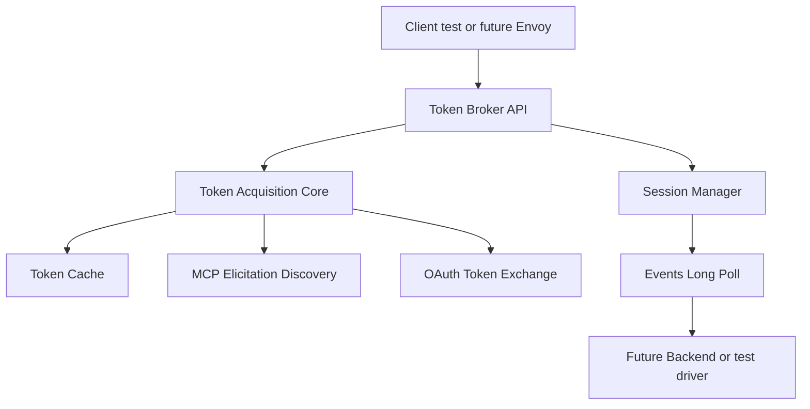

# Token Broker Architecture

## Goal

The **Token Broker** is a standalone service that provides centralized OAuth token management for the Kagenti MCP OAuth system.

This document describes the architecture and implementation of the Token Broker service.

---

## Architecture Overview

The Token Broker separates OAuth concerns from the sidecar proxy:

- Centralized token cache and session management
- OAuth discovery against MCP servers
- Token exchange and caching
- REST API for token acquisition
- Long-polling for OAuth event coordination

The new design in [`docs/envoy_sidecar.md`](docs/envoy_sidecar.md) and [`docs/envoy_sidecar_claude.md`](docs/envoy_sidecar_claude.md) changes the system boundary significantly:

- the Token Broker becomes a standalone shared service
- Envoy becomes the enforcement point later, not the broker itself
- the broker owns session state and token acquisition state
- Backend communication happens over explicit REST endpoints and long-polling
- token acquisition is modeled around sessions and events, not sidecar-local request suspension

Because the architectural center of gravity changes, trying to incrementally mutate the current sidecar code into the new broker will create coupling and make later deletion harder.

---

## Repository Structure

The Token Broker is implemented as a standalone service:

```text
cmd/token-broker/          # Service entry point
internal/tokenbroker/      # Core implementation
  ├── api/                 # HTTP handlers and routing
  ├── core/                # Service orchestration
  ├── cache/               # Token caching with JWT parsing
  ├── session/             # Session management
  └── oauthflow/           # OAuth discovery and exchange
```

### Command Layer

- [`cmd/token-broker/main.go`](cmd/token-broker/main.go)
  Service bootstrap, configuration, HTTP server, logging, graceful shutdown.

### Internal packages

- [`internal/tokenbroker/api`](internal/tokenbroker/api)  
  HTTP handlers, request parsing, JSON responses, route wiring.

- [`internal/tokenbroker/core`](internal/tokenbroker/core)  
  Main service orchestration. Coordinates session store, token cache, OAuth discovery, PKCE state, and token acquisition.

- [`internal/tokenbroker/cache`](internal/tokenbroker/cache)  
  Token cache keyed by user and MCP server.

- [`internal/tokenbroker/session`](internal/tokenbroker/session)  
  Session model, lifecycle, per-session semaphore, long-poll event coordination, timeout handling.

- [`internal/tokenbroker/oauthflow`](internal/tokenbroker/oauthflow)  
  MCP elicitation discovery, OAuth metadata handling, PKCE generation, state tracking, code exchange.

- [`internal/tokenbroker/testsupport`](internal/tokenbroker/testsupport)  
  Mock MCP servers, fake OAuth providers, helper builders for integration and e2e tests.

This structure keeps the new design cohesive and removable as a unit later if needed, while also making the old implementation removable independently.

---

## Reuse vs separation

Phase 1 should prefer **reusing leaf-level OAuth utilities** but **not reusing current AuthBridge orchestration**.

### Safe to reuse conceptually or by extracting later

Current code that may inspire or partially contribute to the new implementation:

- [`pkg/oauth/elicitation.go`](pkg/oauth/elicitation.go) for `AuthURLRequest`/`AuthURLResponse` types (used to parse the MCP server's `/auth/url` response). Note: the Token Broker does **not** call `BuildAuthorizationURL` or `GeneratePKCEChallenge` — those are MCP server-side functions. The Token Broker only needs the response types to deserialize what the MCP server returns.
- [`pkg/http/oauth/token_exchange.go`](pkg/http/oauth/token_exchange.go) for understanding the `/oauth/exchange-token` request/response shape (the Token Broker calls this endpoint as a client, not serves it)
- [`pkg/http/oauth/elicitation.go`](pkg/http/oauth/elicitation.go) for structured JSON error handling style

### Should not be reused as the basis of the new broker

- [`internal/authbridge/authbridge.go`](internal/authbridge/authbridge.go)
- [`cmd/authbridge-sidecar/main.go`](cmd/authbridge-sidecar/main.go)

Reason: these are built around sidecar-local interception and request suspension, while the new design is a session-based broker service.

---

## Implementation Structure

The Token Broker is implemented as:

1. Standalone service: [`cmd/token-broker/main.go`](cmd/token-broker/main.go)
2. Core logic under: [`internal/tokenbroker/`](internal/tokenbroker/)
3. Reuses generic packages from [`pkg/`](pkg/) for protocol-level functionality
4. Dedicated tests in broker packages and e2e tests

---

## Service Responsibilities

The standalone Token Broker should own the following:

- create and terminate OAuth sessions
- validate session ownership by user ID
- maintain session timeout lifecycle
- provide long-poll events to a future Backend
- obtain and cache tokens per user and MCP server
- ensure only one token acquisition flow happens per session at a time
- perform MCP elicitation discovery against an MCP server (synthetic request → 401 → discovery → `/auth/url`)
- receive and store the `code_verifier` from the MCP server's `/auth/url` response until exchange
- exchange authorization code for token via the MCP server's `/oauth/exchange-token` endpoint
- unblock waiting token requests when token is available or when the session fails

### Configuration

The Token Broker requires the following configuration:

- **`callback_url`** — the URL the OAuth provider redirects to after user authorization (e.g., `http://backend-service:8187/callback`). This is passed to the MCP server's `POST /auth/url` endpoint as `{"callback_url": "..."}`. For Phase 1 testing, this can be any URL since the test driver simulates the callback.
- **`listen_port`** — HTTP server port (default: 8190)
- **`session_timeout`** — idle session timeout (default: 60s)
- **`max_sessions_per_user`** — max concurrent sessions per user (default: 5)
- **`token_wait_timeout`** — max time to wait for OAuth completion (default: 300s)

---

## Proposed HTTP API for Phase 1

Phase 1 should implement the REST contract defined by [`docs/envoy_sidecar_claude.md`](docs/envoy_sidecar_claude.md), even though Envoy and Backend are not yet implemented.

## Session creation

**Endpoint**

- `POST /sessions`

**Headers**

- `X-User-ID`

**Response**

- `201 Created`
- body:
  ```json
  {
    "oauth_session_key": "uuid-or-random-id"
  }
  ```

**Errors**

- `400` missing user id
- `429` max sessions per user exceeded

---

## Events endpoint

**Endpoint**

- `POST /sessions/{oauth_session_key}/events`

**Headers**

- `X-User-ID`

**Modes**

1. long-poll for broker-to-backend events
2. OAuth completion callback submission via query params:
   - `code`
   - `state`

**Long-poll response examples**

```json
{
  "type": "oauth_required",
  "mcp_server_url": "http://mcp-server-service:8184",
  "auth_url": "https://provider.example/authorize?...&state=opaque-state"
}
```

```json
{
  "type": "error",
  "message": "Session expired",
  "code": "session_expired"
}
```

Decision for Phase 1: one event per response, matching [`docs/envoy_sidecar_claude.md`](docs/envoy_sidecar_claude.md).

---

## Direct token acquisition endpoint for Phase 1 testing

**Endpoint**

- `POST /sessions/{oauth_session_key}/token`

**Headers**

- `X-User-ID`
- `X-Mcp-Server-Url`

**Behavior**

- blocks until token is available or flow fails
- checks cache before and after semaphore acquisition
- if cache miss persists, triggers OAuth discovery and waits for completion through the events flow

**Response**

```json
{
  "token": "access-token"
}
```

**Errors**

- `401` invalid session or user mismatch
- `408` timed out waiting for OAuth completion
- `503` internal acquisition failure

This endpoint is mainly for testability in Phase 1 and mirrors the future broker behavior.

---

## Optional ext_authz compatibility in Phase 1

There are two valid planning options:

### Option A: defer [`POST /ext_authz`](docs/envoy_sidecar_claude.md)
Pros:
- smaller Phase 1
- less HTTP-surface area before Envoy phase

Cons:
- later phase will need one more endpoint addition

### Option B: include [`POST /ext_authz`](docs/envoy_sidecar_claude.md) now as a thin adapter
Pros:
- aligns the broker API to the final design early
- easy to test same acquisition flow through a second entrypoint

Cons:
- slightly larger Phase 1

Recommendation: implement [`POST /ext_authz`](docs/envoy_sidecar_claude.md) in Phase 1 as a thin wrapper over the same core acquisition path, but treat it as secondary test coverage rather than the primary path.

---

## End session endpoint

**Endpoint**

- `POST /sessions/{oauth_session_key}/end`

**Headers**

- `X-User-ID`

**Behavior**

- marks session terminated
- wakes blocked waiters with session-ended error
- releases resources

**Response**

- `200 OK`

---

## Internal design

## Core interfaces

The internal design should revolve around explicit interfaces so that tests can fake MCP and OAuth dependencies.

Suggested interfaces:

- `SessionStore`
- `TokenCache`
- `OAuthDiscoverer`
- `TokenExchanger`
- `Clock`

This allows deterministic tests for timeout and concurrency behavior.

---

## Session model

Each session should contain:

- `session_key`
- `user_id`
- `created_at`
- `last_backend_poll_state`
- `expiration_deadline`
- acquisition semaphore with capacity 1
- pending event waiter
- pending token waiters
- active OAuth transaction if one exists

Active OAuth transaction should contain:

- `mcp_server_url`
- `auth_url` (received from MCP server's `/auth/url` response)
- `code_verifier` (received from MCP server's `/auth/url` response — Token Broker does not generate this)
- status such as waiting, completed, failed
- completion result channel or condition variable

Note: `state` is not stored separately — it is embedded in the `auth_url` by the MCP server. The Backend extracts `state` from the OAuth callback redirect and sends it back with the `code`.

Important design choice: the OAuth transaction belongs to the session, not to the token cache.

---

## Token cache model

Cache key:

- `user_id`
- `mcp_server_url`

Cached value:

- `access_token`
- derived expiry time
- created time

Behavior:

- if expired, treat as missing
- if near expiry, less than 5 minutes remaining, treat as missing per [`docs/envoy_sidecar.md`](docs/envoy_sidecar.md:72)
- tokens are **not** session-bound

---

## OAuth discovery flow in the broker

When a token is needed and absent:

1. Validate session and user
2. Acquire per-session semaphore
3. Recheck cache (another request may have obtained the token while waiting)
4. Send synthetic unauthenticated `POST /mcp` (tools/list JSON-RPC body, no `Authorization` header) to target MCP server
5. Expect `401 Unauthorized`
6. `GET /.well-known/oauth-protected-resource` on MCP server to discover `authorization_servers`
7. `POST /auth/url` on MCP server with `{"callback_url": "<configured_callback_url>"}` — MCP server generates PKCE (code_verifier + code_challenge) and state, builds the authorization URL, returns `{url, code_verifier}`
8. Store received `code_verifier` in the session's active OAuth transaction
9. Publish `oauth_required` event with `auth_url` and `mcp_server_url` (Backend receives this via long-poll)
10. Wait for `/events?code=...&state=...` from Backend
11. `POST /oauth/exchange-token` on MCP server with `{"code": "...", "code_verifier": "..."}` — MCP server exchanges with OAuth provider using its `client_secret`, returns access token
12. Cache received access token
13. Unblock token waiters
14. Release semaphore

Note: the Token Broker does **not** generate PKCE — it receives the `code_verifier` from the MCP server's `/auth/url` response and holds it until the exchange step. The `client_secret` is held only by the MCP server.

---

## MCP discovery mechanics

Phase 1 should isolate MCP discovery logic in [`internal/tokenbroker/oauthflow`](internal/tokenbroker/oauthflow).

That component should:

- send synthetic `POST /mcp` with a `tools/list` JSON-RPC body and no `Authorization` header to trigger elicitation
- expect `401 Unauthorized` response
- call `GET /.well-known/oauth-protected-resource` on the MCP server to discover `authorization_servers`
- call `POST /auth/url` on the MCP server with `{"callback_url": "<configured_callback_url>"}` — receives `{url, code_verifier}` (MCP server generates PKCE internally)
- store the received `code_verifier` for later exchange
- after Backend provides `code` and `state`, call `POST /oauth/exchange-token` on the MCP server with `{"code": "...", "code_verifier": "..."}` — receives the access token

This is intentionally isolated because MCP elicitation behavior is protocol-specific and likely to evolve.

---

## Concurrency behavior

Phase 1 must preserve these guarantees:

### Per-session single acquisition

Only one token acquisition flow may run at a time for a given session.

### Double-checked cache

Check token cache:

- before acquiring semaphore
- after acquiring semaphore

This avoids duplicate OAuth flows.

### Shared token cache across sessions

Different sessions for the same user and MCP server should share the cached token.

### Session end and timeout propagation

If a session ends or expires:

- blocked `/token` requests fail
- blocked `/events` long-poll returns an error event or request error, depending on context
- active OAuth transaction is cancelled

### No cross-session coupling

Two different sessions must not block each other unless they intentionally share only cache results after completion.

---

## Timeout behavior for Phase 1

Recommended defaults, matching the supplement:

- session timeout after backend disconnect or idle poll gap: `60s`
- token wait timeout: `300s`
- max sessions per user: `5`

Implementation note:
the session package should own timer transitions so timeout behavior does not leak into handlers.

---

## Error model

All broker errors should return JSON.

Suggested response shape:

```json
{
  "error": {
    "code": "session_expired",
    "message": "Session expired"
  }
}
```

This is slightly more regular than the current mixed styles in [`pkg/http/oauth/token_exchange.go`](pkg/http/oauth/token_exchange.go) and [`pkg/http/oauth/elicitation.go`](pkg/http/oauth/elicitation.go).

For Phase 1, standardize broker responses even if older code elsewhere uses different shapes.

---

## Test strategy for Phase 1

Phase 1 should include strong tests because this phase is primarily about validating the new architecture without Envoy or Backend.

## Unit tests

### Session tests
Test [`internal/tokenbroker/session`](internal/tokenbroker/session) for:

- create session
- reject wrong user
- end session
- idle timeout expiry
- only one acquisition at a time
- wake waiters on termination

### Cache tests
Test [`internal/tokenbroker/cache`](internal/tokenbroker/cache) for:

- set and get token
- expired token treated as missing
- near-expiry token treated as missing
- per-user per-server isolation

### OAuth flow tests
Test [`internal/tokenbroker/oauthflow`](internal/tokenbroker/oauthflow) for:

- successful elicitation discovery
- non-401 discovery failure
- bad state on callback
- successful code exchange
- exchange failure propagation

### Core orchestration tests
Test [`internal/tokenbroker/core`](internal/tokenbroker/core) for:

- cached token fast path
- semaphore-guarded acquisition
- cache recheck after lock
- session timeout cancelling blocked acquisition
- session end cancelling blocked acquisition

---

## HTTP handler tests

Test [`internal/tokenbroker/api`](internal/tokenbroker/api) for:

- `POST /sessions`
- `POST /sessions/{key}/token`
- `POST /sessions/{key}/events`
- `POST /sessions/{key}/end`
- optional `POST /ext_authz`

These should validate status codes, JSON schemas, and header requirements.

---

## E2E-style broker tests

Add broker-focused integration tests that spin up:

- a test Token Broker server
- a fake MCP server supporting elicitation behavior
- a fake OAuth provider token endpoint

Suggested scenarios:

1. **Create session then request token**
   - token request blocks
   - events endpoint returns `oauth_required`

2. **Complete OAuth**
   - callback arrives through events endpoint
   - token request unblocks with token
   - token is cached

3. **Repeat token request**
   - returns immediately from cache
   - no second OAuth flow

4. **Parallel token requests in same session**
   - only one OAuth discovery occurs

5. **Two sessions same user same MCP server**
   - second session uses cached token after first succeeds

6. **Session expiry while waiting**
   - blocked token request fails correctly

7. **Wrong user on session endpoints**
   - request rejected

These tests are more important than Envoy tests in Phase 1.

---

## Suggested implementation sequence

1. Create new broker package tree under [`internal/tokenbroker`](internal/tokenbroker)
2. Implement config and service bootstrap in [`cmd/token-broker/main.go`](cmd/token-broker/main.go)
3. Implement session store and lifecycle manager
4. Implement token cache with expiry and near-expiry logic
5. Implement OAuth discovery and token exchange abstractions
6. Implement broker core acquisition workflow
7. Implement HTTP API handlers
8. Add unit tests per package
9. Add e2e-style standalone broker tests
10. Add minimal documentation for running the broker locally

---

## Mermaid overview



---

## Resolved design choices

1. **Include `POST /ext_authz` in Phase 1** — yes, as a thin wrapper over the same core acquisition path. This means Phase 4 (Envoy integration) is pure config, no broker code changes.
2. **Consolidated JSON error schema from day one** — yes, use `{"error": {"code": "...", "message": "..."}}` for all broker error responses.
3. **Synthetic MCP discovery request is always `tools/list`** — not configurable for the POC.
4. **No K8s manifests in Phase 1** — code and tests only. Manifests are added in Phase 2.

---

## Recommended plan

Recommendation for implementation approval:

- build a brand-new standalone broker in [`cmd/token-broker`](cmd/token-broker) and [`internal/tokenbroker`](internal/tokenbroker)
- do not modify current sidecar/AuthBridge architecture except for tiny reusable helpers if absolutely needed
- implement full session, events, token, end, and ext_authz endpoints in Phase 1
- include [`POST /ext_authz`](docs/envoy_sidecar_claude.md) as a thin compatibility wrapper over the core acquisition path
- use consolidated JSON error schema from day one
- invest heavily in broker unit and e2e tests
- defer Envoy and Backend work entirely to later phases

This gives the cleanest migration path and the lowest risk of contaminating the new design with old architectural assumptions.