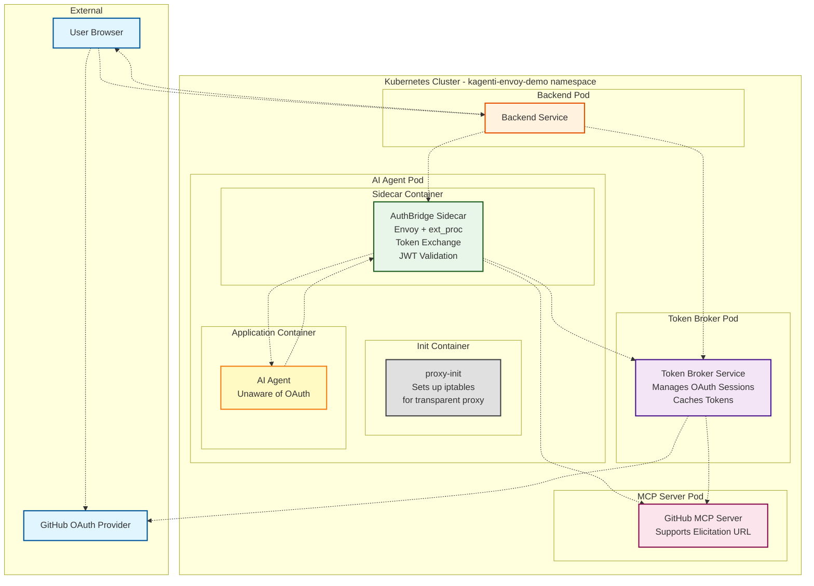
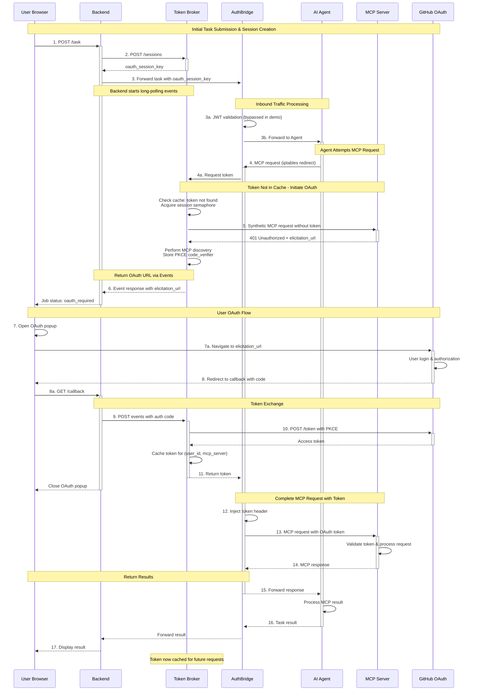
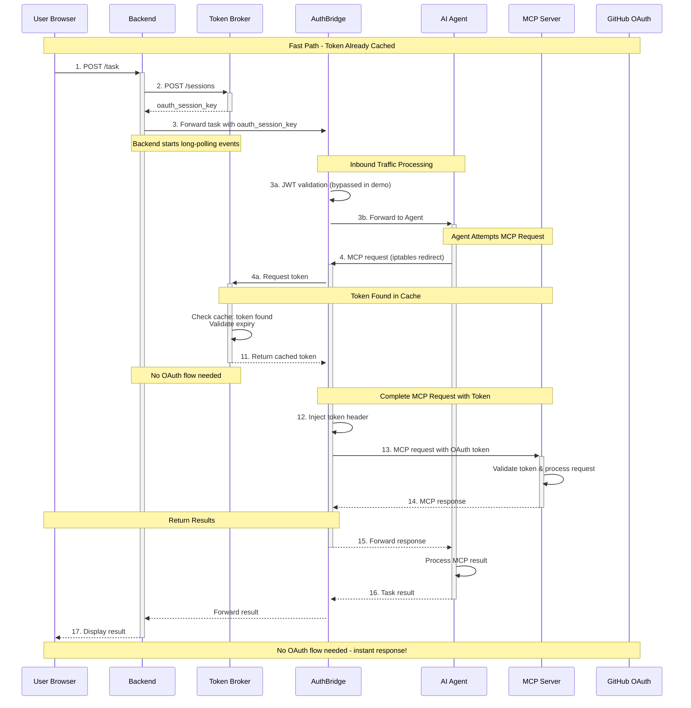

# Kagenti Envoy Demo Architecture

This document provides a comprehensive architecture diagram for the k8s/envoy-demo deployment, showing how the Kagenti system implements MCP Elicitation URL Mode using Envoy-based transparent proxying.

## Overview

The Kagenti Envoy Demo demonstrates a secure, token-based communication system between an AI Agent and an MCP server using OAuth authentication. The system uses a Token Broker for centralized token management and Envoy for transparent proxying with ext_proc for token injection.

## Architecture Diagram

### Component Overview

### Sequence Diagram: Complete OAuth Flow

### Sequence Diagram: Subsequent Request with Cached Token

## Component Details

### 1. Backend Service (Port 30187)
- **Purpose**: User-facing application server
- **Responsibilities**:
  - Serves demo UI to users
  - Creates OAuth sessions with Token Broker
  - Forwards tasks to AI Agent with `oauth_session_key`
  - Long-polls Token Broker for OAuth events
  - Handles OAuth callbacks and sends auth codes to Token Broker
- **Key Endpoints**:
  - `POST /task` - Submit tasks
  - `GET /job/{id}` - Poll job status
  - `GET /callback` - OAuth callback handler

### 2. Token Broker Service (Port 8190)
- **Purpose**: Centralized OAuth session and token management
- **Responsibilities**:
  - Creates and manages OAuth sessions per user
  - Caches tokens per (user_id, mcp_server) combination
  - Initiates OAuth flows when tokens are missing
  - Performs token exchange with OAuth provider
  - Implements session semaphore to prevent concurrent OAuth flows
- **Key Endpoints**:
  - `POST /sessions` - Create session
  - `POST /sessions/{key}/token` - Request token
  - `GET /sessions/{key}/events` - Long-poll for OAuth events
  - `POST /sessions/{key}/events` - Send OAuth events
  - `POST /sessions/{key}/end` - End session
- **Configuration**:
  - Session timeout: 60s
  - Max sessions per user: 5
  - Token wait timeout: 300s (5 minutes)

### 3. AI Agent Pod with Envoy Sidecar

#### Init Container: proxy-init
- **Purpose**: Configure iptables for transparent proxying
- **Actions**:
  - Redirects outbound traffic to Envoy (port 15123)
  - Redirects inbound traffic to Envoy (port 15124)
  - Excludes Envoy's own traffic (UID 1337)
  - Excludes localhost communication
  - Excludes Token Broker port (8190)

#### Envoy Proxy
- **Purpose**: Transparent proxy with ext_proc integration
- **Listeners**:
  - **Outbound (15123)**: Agent → MCP Server
    - Intercepts HTTP traffic for token injection
    - TLS passthrough for HTTPS
    - Calls AuthBridge ext_proc for token exchange
    - Timeout: 310s (supports long OAuth flows)
  - **Inbound (15124)**: Backend → Agent
    - Receives traffic from Backend
    - Calls AuthBridge ext_proc for JWT validation
    - Timeout: 30s
  - **Admin (9901)**: Management interface
- **Clusters**:
  - `authbridge_cluster` - ext_proc gRPC (localhost:9090)
  - `token_broker` - Token Broker service
  - `mcp_server_1` - MCP Server service
  - `local_agent` - AI Agent (localhost:8186)
  - `original_destination` - For transparent proxying

#### AuthBridge ext_proc
- **Purpose**: External processor for token exchange and JWT validation
- **Responsibilities**:
  - **Inbound**: Validates JWT tokens from Backend (bypassed in demo)
  - **Outbound**: Requests tokens from Token Broker and injects into MCP requests
- **Configuration**:
  - Routes with `action: broker` use Token Broker
  - Matches host patterns like `mcp-server-service` and `mcp-*`
  - Token Broker URL: `http://token-broker-service:8190`

#### AI Agent
- **Purpose**: LLM-based AI agent that processes tasks
- **Characteristics**:
  - Unaware of OAuth and token management
  - Never sees 401 responses or auth URLs
  - Sends requests directly to MCP server
  - Traffic transparently intercepted by Envoy via iptables

### 4. MCP Server (Port 30184)
- **Purpose**: GitHub MCP server with OAuth authentication
- **Responsibilities**:
  - Provides GitHub tools via MCP protocol
  - Supports MCP Elicitation URL Mode
  - Returns 401 with `elicitation_url` when token is missing
  - Validates OAuth tokens on requests
- **Configuration**:
  - Container port: 8082
  - Service port: 8184
  - OAuth redirect URI: `http://localhost:8187/callback`
  - OAuth scopes: `repo,read:org,read:user,user:email`

### 5. GitHub OAuth Provider
- **Purpose**: External identity provider
- **Responsibilities**:
  - Authenticates users
  - Issues authorization codes
  - Exchanges codes for access tokens
  - Provides user-scoped tokens

## Communication Flows

### Flow 1: Initial Task Submission (Steps 1-3)
1. User submits task via Browser to Backend
2. Backend creates session with Token Broker, receives `oauth_session_key`
3. Backend forwards task to AI Agent with `oauth_session_key` header
4. Envoy inbound listener receives traffic, AuthBridge validates (bypassed in demo)
5. Traffic forwarded to AI Agent

### Flow 2: MCP Request with Token Acquisition (Steps 4-13)
1. AI Agent sends MCP request to MCP server
2. iptables redirects to Envoy outbound listener (15123)
3. Envoy calls AuthBridge ext_proc for token exchange
4. AuthBridge requests token from Token Broker with `oauth_session_key`
5. Token Broker checks cache - token not found
6. Token Broker sends synthetic request to MCP Server without token
7. MCP Server returns 401 with `elicitation_url`
8. Token Broker returns `elicitation_url` via events endpoint to Backend
9. Backend opens OAuth popup for user
10. User authenticates with GitHub OAuth Provider
11. OAuth Provider redirects to Backend callback with auth code
12. Backend sends auth code to Token Broker via events endpoint
13. Token Broker exchanges code for token with OAuth Provider
14. Token Broker caches token and returns to AuthBridge
15. AuthBridge injects token into request headers
16. Envoy forwards request with token to MCP Server

### Flow 3: Subsequent Requests (Cached Token)
1. AI Agent sends MCP request
2. Envoy intercepts, AuthBridge requests token
3. Token Broker finds cached token, returns immediately
4. AuthBridge injects token, request proceeds to MCP Server
5. No user interaction required

### Flow 4: Response Flow (Steps 14-17)
1. MCP Server processes request and returns response
2. Envoy forwards response to AI Agent
3. AI Agent processes response and returns result
4. Result flows back through Envoy to Backend
5. Backend displays result to user

## Key Design Patterns

### 1. Transparent Proxying
- iptables redirects all traffic to Envoy
- AI Agent unaware of proxy
- No code changes required in Agent

### 2. Session Management
- `oauth_session_key` ties all operations to user session
- Token Broker correlates Backend events with AuthBridge token requests
- Session semaphore prevents concurrent OAuth flows per session

### 3. Token Caching
- Tokens cached per (user_id, mcp_server)
- Not tied to specific sessions
- Tokens reused across sessions for same user/server

### 4. Separation of Concerns
- **Backend**: User interaction, OAuth UI flow
- **Token Broker**: OAuth logic, token management, caching
- **AuthBridge**: Token injection, JWT validation
- **Envoy**: Traffic routing, transparent proxying
- **AI Agent**: Task processing (OAuth-agnostic)

### 5. Long-Running OAuth Support
- Extended timeouts (310s) for user OAuth completion
- Long-polling events endpoint for async OAuth flow
- Session timeout management

## Security Considerations

1. **Token Isolation**: AI Agent never sees tokens
2. **User Scoping**: Tokens are user-specific
3. **Session Validation**: Token Broker validates user_id in requests
4. **PKCE Support**: Token Broker implements PKCE for OAuth
5. **Token Expiry**: Cached tokens checked for expiration (5 min buffer)

## Network Ports Summary

| Component | Container Port | Service Port | NodePort | Purpose |
|-----------|---------------|--------------|----------|---------|
| Backend | 8187 | 8187 | 30187 | User interface |
| Token Broker | 8190 | 8190 | - | OAuth management |
| AI Agent | 8186 | 8186 | 30186 | Task processing |
| Envoy Inbound | 15124 | - | - | Backend → Agent |
| Envoy Outbound | 15123 | - | - | Agent → MCP |
| Envoy Admin | 9901 | - | - | Management |
| AuthBridge ext_proc | 9090 | - | - | Token exchange |
| MCP Server | 8082 | 8184 | 30184 | GitHub tools |

## References

- Design Document: [`docs/envoy_sidecar.md`](../../docs/envoy_sidecar.md)
- MCP Elicitation URL Mode Spec: https://modelcontextprotocol.io/specification/2025-11-25/client/elicitation/
- Deployment Guide: [`DEPLOYMENT.md`](DEPLOYMENT.md)
- Testing Guide: [`TESTING.md`](TESTING.md)