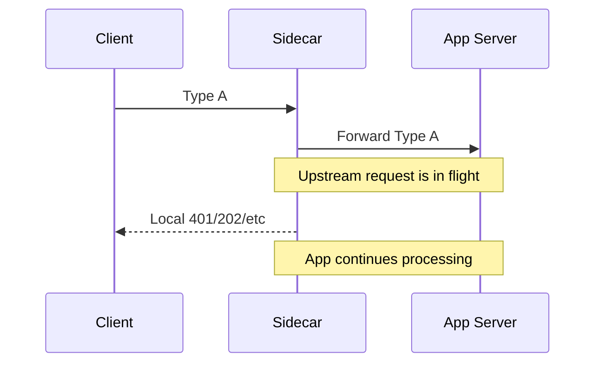
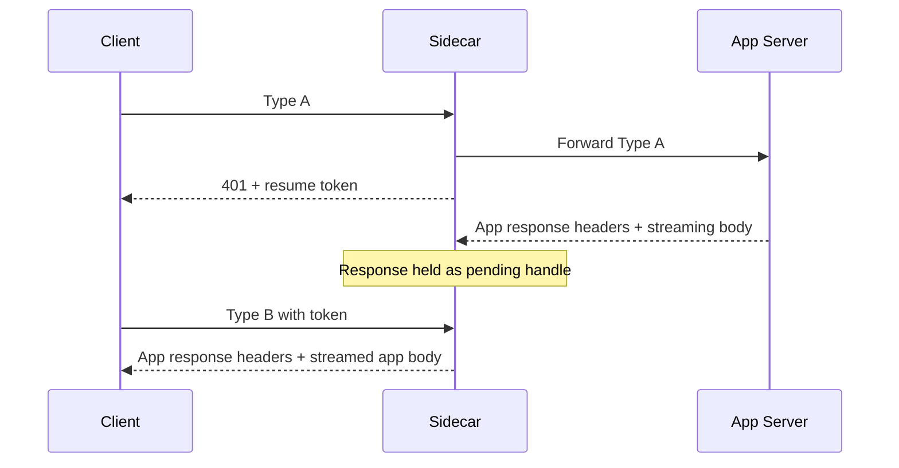
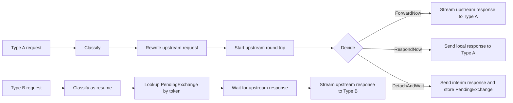

# ExtendedHttpProxy Interface Proposal

This document summarizes the proposed interface for an `ExtendedReverseProxy` package intended to replace `net/http/httputil.ReverseProxy` for inbound sidecar traffic handling.

It is based on:

- `src/net/http/httputil/reverseproxy.go`
- `pkg/ExtendedHttpProxy/Plan.md`

The main conclusion is that the stock reverse proxy has solid request rewriting, transport abstraction, header handling, and response/error hooks, but it assumes a strict 1:1 relation between:

- one inbound request, and
- one outbound upstream response written to the same `http.ResponseWriter`.

That assumption does not fit Scenario 2 in `Plan.md`, where the sidecar must:

1. send a sidecar-generated response to Type A,
2. keep the upstream request running,
3. and later stream the upstream response to a different request, Type B.

---

## 1. What is useful in `httputil.ReverseProxy`

`src/net/http/httputil/reverseproxy.go` provides several design points worth preserving:

- `ProxyRequest` clearly separates:
  - `In *http.Request`
  - `Out *http.Request`
- `Rewrite` is safer than the old `Director`
- `Transport http.RoundTripper` is the correct abstraction for upstream I/O
- `ModifyResponse` and `ErrorHandler` are explicit lifecycle hooks
- header copying, hop-by-hop stripping, trailers, and streaming behavior are already well thought out

Those are good foundations.

---

## 2. What `httputil.ReverseProxy` cannot do for this design

The key limitation is in `ReverseProxy.ServeHTTP()`:

- it performs the upstream request,
- receives the upstream response,
- and writes that response to the same inbound `ResponseWriter`.

For ExtendedHttpProxy, this is not enough.

We need to split the lifecycle into two independent phases:

1. **dispatch upstream request**
2. **bind upstream response to a chosen downstream request**

That is the core missing abstraction.

---

## 3. Core requirement from `Plan.md`

The plan defines two inbound request types:

- **Type A**: normal request to the server behind the sidecar
- **Type B**: special resume request handled by the sidecar and not forwarded to the server

And two scenarios:

- **Scenario 1**: Type A is proxied normally and the upstream response is returned to Type A
- **Scenario 2**:
  - Type A is forwarded to the app
  - the sidecar returns an intermediate response to Type A
  - the app request continues running
  - a later Type B request resumes the flow
  - the upstream app response is sent as the response to Type B

This requires explicit response ownership transfer.

---

## 4. Direct answers to the two key questions

### 4.1 How can we send a response from within the sidecar to the request already sent to the server?

The sidecar still owns the downstream `http.ResponseWriter` for Type A.

The app server does **not** reply directly to the frontend client. It replies to the sidecar's outbound `http.Client` request. Therefore the sidecar can:

1. forward Type A upstream using its own `http.Client`,
2. keep that upstream exchange running in the background,
3. and independently write a local response to the Type A `ResponseWriter`.

This means the sidecar does **not** replace an already-sent server response. Instead, it simply chooses not to forward the upstream response to Type A.

### Sequence



### Minimal example

```go
type pendingCall struct {
    token       string
    respReadyCh chan struct{}
    resp        *http.Response
    err         error
    cancel      context.CancelFunc
}

func (p *Proxy) handleTypeA(w http.ResponseWriter, r *http.Request) {
    token := newToken()

    // Important: use a sidecar-owned context, not r.Context(),
    // if the upstream request must survive after Type A is answered.
    upstreamCtx, cancel := context.WithTimeout(context.Background(), 5*time.Minute)

    outReq := r.Clone(upstreamCtx)
    outReq.RequestURI = ""
    rewriteForApp(outReq)

    call := &pendingCall{
        token:       token,
        respReadyCh: make(chan struct{}),
        cancel:      cancel,
    }
    p.store.Put(token, call)

    go func() {
        resp, err := p.client.Do(outReq)
        call.resp = resp
        call.err = err
        close(call.respReadyCh)
    }()

    // The sidecar answers Type A immediately.
    w.Header().Set("X-Resume-Token", token)
    w.WriteHeader(http.StatusUnauthorized)
    _, _ = w.Write([]byte("resume required"))
}
```

---

### 4.2 How can we wire the server response to the original Type A request so it becomes the response sent on Type B, hopefully without buffering the response body?

By storing the upstream `*http.Response` handle once `http.Client.Do()` returns, and later streaming `resp.Body` directly to the Type B `ResponseWriter`.

This does **not** require buffering the full body.

The sidecar only stores:

- a correlation token,
- a handle to the pending exchange,
- the eventual `*http.Response`,
- cancellation/cleanup state.

The body remains streamed from the upstream connection to Type B using `io.Copy`.

### Sequence



### Minimal example

```go
func (p *Proxy) handleTypeB(w http.ResponseWriter, r *http.Request) {
    token := r.Header.Get("X-Resume-Token")
    if token == "" {
        http.Error(w, "missing token", http.StatusBadRequest)
        return
    }

    call, ok := p.store.Get(token)
    if !ok {
        http.Error(w, "unknown token", http.StatusNotFound)
        return
    }
    defer p.store.Delete(token)
    defer call.cancel()

    select {
    case <-call.respReadyCh:
        if call.err != nil {
            http.Error(w, call.err.Error(), http.StatusBadGateway)
            return
        }
        defer call.resp.Body.Close()

        copyResponseHeaders(w.Header(), call.resp.Header)
        removeHopByHopHeaders(w.Header())

        announceTrailers(w, call.resp)

        w.WriteHeader(call.resp.StatusCode)

        if _, err := io.Copy(w, call.resp.Body); err != nil {
            return
        }

        copyTrailers(w, call.resp.Trailer)

    case <-r.Context().Done():
        return
    }
}
```

---

## 5. Why this avoids buffering the entire response body

`http.Client.Do()` returns an `*http.Response` with a streaming `Body`.

That means:

- headers are available once the response begins,
- the body is consumed incrementally,
- `io.Copy(w, resp.Body)` streams bytes directly,
- memory usage is bounded by copy buffers rather than total response size.

So Scenario 2 can be implemented without buffering the whole response body.

The only requirement is that Type B must wait until the upstream response headers exist.

---

## 6. Important lifecycle rule

For Scenario 2, the upstream app request must not use the Type A request context if the upstream work should continue after Type A receives the sidecar-generated response.

Wrong for deferred flow:

```go
upstreamCtx := r.Context()
```

Correct:

```go
upstreamCtx, cancel := context.WithTimeout(context.Background(), ttl)
```

Otherwise the upstream app request may be canceled as soon as the sidecar completes Type A.

---

## 7. Proposed interface

The package should preserve the good parts of `httputil.ReverseProxy` but add an abstraction for pending detached upstream exchanges.

### Main types

```go
package extendedhttpproxy

import (
    "context"
    "log"
    "net/http"
    "time"
)

type RequestKind int

const (
    RequestKindForward RequestKind = iota // Type A
    RequestKindResume                     // Type B
)

type ResumeToken struct {
    ID string
}

type InboundRequest struct {
    Kind  RequestKind
    In    *http.Request
    Token ResumeToken
}

type UpstreamRequest struct {
    In    *http.Request
    Out   *http.Request
    Token ResumeToken
    Ctx   context.Context
}
```

### Pending detached exchange

This is the key abstraction missing from `httputil.ReverseProxy`.

```go
type PendingExchange interface {
    Token() ResumeToken
    WaitResponse(context.Context) (*http.Response, error)
    Cancel(error)
}
```

This interface lets the proxy:

- dispatch an upstream request now,
- answer the current downstream request however it wants,
- and later attach the upstream response to another downstream request.

---

## 8. Action model

We need an explicit decision point after the upstream request is prepared.

```go
type ProxyAction interface {
    isProxyAction()
}

type ForwardNow struct{}

type RespondNow struct {
    StatusCode int
    Header     http.Header
    Body       []byte
}

type DetachAndWait struct {
    InterimStatusCode int
    InterimHeader     http.Header
    InterimBody       []byte
}

func (ForwardNow) isProxyAction()    {}
func (RespondNow) isProxyAction()    {}
func (DetachAndWait) isProxyAction() {}
```

Semantics:

- `ForwardNow`: use the current Type A request as the response destination
- `RespondNow`: the sidecar returns a fully local response and does not wait for upstream
- `DetachAndWait`: send an interim response to Type A, keep upstream running, and later bind upstream response to Type B

---

## 9. Hook functions

```go
type ClassifyFunc func(*http.Request) (InboundRequest, error)

type RewriteFunc func(*UpstreamRequest)

type DecideFunc func(*UpstreamRequest) (ProxyAction, error)

type ResumeHandlerFunc func(http.ResponseWriter, *http.Request, PendingExchange) error

type ModifyResponseFunc func(*http.Response, ResumeToken) error

type ErrorHandlerFunc func(http.ResponseWriter, *http.Request, error)
```

### Intent of each hook

- `ClassifyFunc`
  - decides whether an inbound request is Type A or Type B
  - extracts the resume token if present

- `RewriteFunc`
  - rewrites the outbound request
  - analogous to `ReverseProxy.Rewrite`

- `DecideFunc`
  - decides whether this is normal forwarding or detached flow

- `ResumeHandlerFunc`
  - controls how Type B consumes a pending exchange

- `ModifyResponseFunc`
  - allows response mutation before streaming

- `ErrorHandlerFunc`
  - central error policy

---

## 10. Storage abstraction

```go
type PendingStore interface {
    Put(ResumeToken, PendingExchange, time.Time) error
    Get(ResumeToken) (PendingExchange, bool)
    Delete(ResumeToken) error
}
```

This store tracks detached exchanges for Scenario 2.

It should support:

- expiration / TTL,
- cleanup on success,
- cleanup on error,
- cleanup if Type B never arrives.

---

## 11. Main proxy type

```go
type ExtendedReverseProxy struct {
    Classify       ClassifyFunc
    Rewrite        RewriteFunc
    Decide         DecideFunc
    HandleResume   ResumeHandlerFunc
    ModifyResponse ModifyResponseFunc
    ErrorHandler   ErrorHandlerFunc

    Transport     http.RoundTripper
    BufferPool    interface{ Get() []byte; Put([]byte) }
    FlushInterval time.Duration
    ErrorLog      *log.Logger

    Store   PendingStore
    Timeout time.Duration
}
```

### Why this shape fits the plan

It preserves the strengths of `httputil.ReverseProxy`:

- inbound/outbound request split,
- explicit rewrite hook,
- transport abstraction,
- response/error hooks,

while adding the missing capability:

- response ownership transfer from Type A to Type B.

---

## 12. Suggested minimal version of the public API

If a smaller API is preferred, the public surface can be reduced to:

```go
type ExtendedReverseProxy struct {
    Classify      func(*http.Request) (RequestKind, ResumeToken, error)
    Rewrite       func(*UpstreamRequest)
    Decide        func(*UpstreamRequest) (ProxyAction, error)
    HandleResume  func(http.ResponseWriter, *http.Request, PendingExchange) error

    Transport      http.RoundTripper
    ModifyResponse func(*http.Response, ResumeToken) error
    ErrorHandler   func(http.ResponseWriter, *http.Request, error)
    Store          PendingStore
}
```

This still covers the essential control points.

---

## 13. Simplest conceptual split

Internally, the main capability should look like this:

```go
type Dispatcher interface {
    Dispatch(*http.Request) (PendingExchange, error)
}

func StreamHTTPResponse(w http.ResponseWriter, resp *http.Response) error
```

Usage:

```go
pending, err := proxy.Dispatch(req)
if err != nil {
    return err
}

// Type A:
writeInterimResponse(w, pending.Token())

// Later, Type B:
resp, err := pending.WaitResponse(ctx)
if err != nil {
    return err
}
return StreamHTTPResponse(typeBW, resp)
```

This makes the required lifecycle explicit:

1. dispatch upstream now,
2. bind response later.

---

## 14. Flow diagram



---

## 15. Practical implementation recommendations

The implementation should reuse concepts and helper logic from `src/net/http/httputil/reverseproxy.go`, especially:

- header copy behavior
- hop-by-hop header removal
- trailer forwarding
- flush behavior for streaming responses
- transport usage
- modify-response and error hooks

What should **not** be reused unchanged is the assumption that the upstream response must always be written to the same request's `ResponseWriter`.

That assumption is exactly what ExtendedHttpProxy must break.

---

## 16. Short summary

The central new primitive is not just another callback. It is a detachable upstream exchange.

That means:

- Type A can be forwarded upstream,
- the sidecar can still send its own response to Type A,
- the upstream app request can continue,
- and the upstream response can later be streamed to Type B without buffering the full response body.

In short:

1. **Answer to question 1**  
   The sidecar can send its own response to Type A because the sidecar still owns Type A's `ResponseWriter` even after it has forwarded the request upstream with `http.Client`.

2. **Answer to question 2**  
   The sidecar can send the upstream response on Type B by storing a pending exchange and later streaming the upstream `resp.Body` directly to Type B with `io.Copy`, without buffering the entire response body.